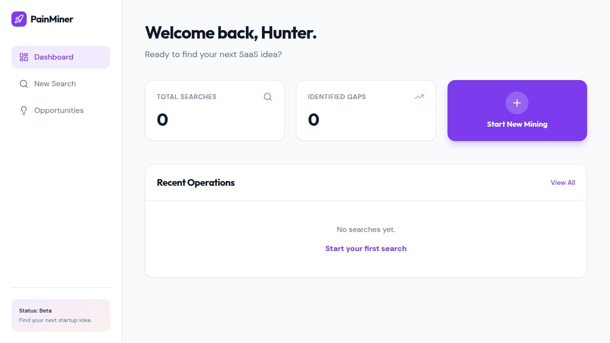
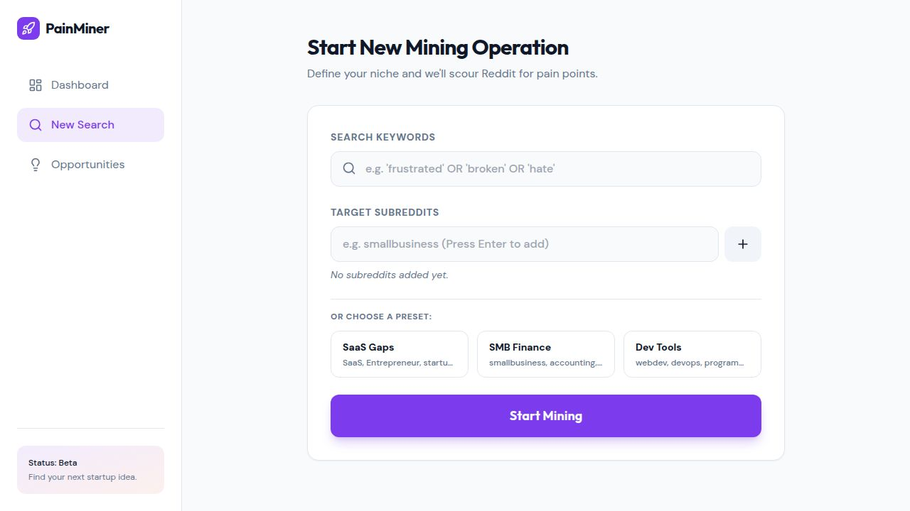

# Reddit Pain Miner

A full-stack web app that mines Reddit for startup opportunities by analyzing pain points and frustrations in posts. Uses AI to turn raw user complaints into actionable business ideas.



## Features

- **Reddit Mining** — Search multiple subreddits with custom queries to surface posts expressing real user frustrations
- **Pain Signal Scoring** — Automated scoring that detects buyer intent, frustration, solution-seeking, and more
- **AI-Powered Analysis** — Claude analyzes top pain signals and generates ranked startup opportunity recommendations
- **Dashboard** — Overview of recent searches, identified market gaps, and search history
- **Preset Searches** — Quick-start templates for common niches (SaaS Gaps, SMB Finance, Dev Tools)

## Screenshots

### New Search


## How It Works

1. You enter a niche/topic and pick subreddits to mine
2. The app fetches up to 50 posts per subreddit and scores each one for pain signals
3. Claude analyzes the top posts and returns a list of ranked startup opportunities with confidence scores

### Pain Signal Scoring

| Signal | Points | Keywords |
|---|---|---|
| Buyer Intent | 5 | "willing to pay", "budget for", "invest in" |
| Frustration | 4 | "frustrated", "nightmare", "hate", "sick of" |
| Stuck | 3 | "stuck", "struggling", "can't figure out" |
| Seeking | 2 | "is there any", "looking for", "recommend" |
| Question | 1 | Posts starting with how/what/why |

## Tech Stack

- **Frontend**: React + TypeScript, TailwindCSS, Shadcn UI, Recharts
- **Backend**: Express.js + TypeScript
- **Database**: PostgreSQL with Drizzle ORM
- **AI**: Anthropic Claude

## Getting Started

```bash
# Install dependencies
npm install

# Push the database schema
npm run db:push

# Start the development server
npm run dev
```

### Environment Variables

| Variable | Description |
|---|---|
| `DATABASE_URL` | PostgreSQL connection string |
| `ANTHROPIC_API_KEY` | Anthropic API key for Claude |

## API

| Method | Path | Description |
|---|---|---|
| POST | `/api/searches` | Start a new search |
| GET | `/api/searches` | List all searches |
| GET | `/api/searches/:id` | Get search with posts and opportunities |
| GET | `/api/opportunities` | List all identified opportunities |

## License

MIT
